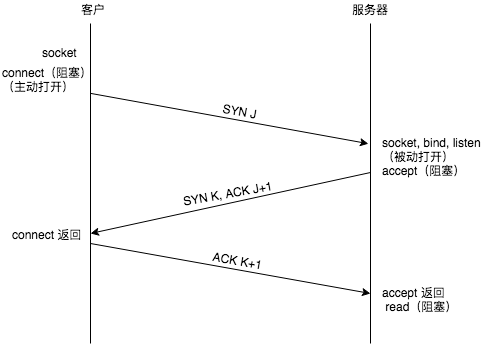

# 从用户在浏览器中输入URL到浏览器出现页面，中间包含哪些过程？  

## DNS查询

1、浏览器搜索自己的DNS缓存
2、搜索操作系统中的DNS缓存(以及hosts文件)；
3、操作系统向本地域名服务器发送解析请求；
4、本地域名服务器进行递归查询或迭代查询 返回结果；

## TCP连接

浏览器发起一个线程，创建一个socke流套接字，绑定服务器IP及端口(web服务器知名端口80)，执行socket.connect()进行对服务器的连接；
web服务器则一直监听80端口，等待客户端的连接socket.accept();
当有有client进行连接请求时：服务器创建一个子线程，专门处理该客户端的请求；

这个套接字连接的过程，就是执行着tcp协议 建立连接的三次握手过程

1. 客户端首先发起同步请求报文 SYN = 1, seq = x; 进入SYN_SEND阶段, 等待server响应；
2. 服务器收到 SYN = 1 的报文， 知道是客户端请求连接；返回一个同步确认报文 SYN = 1, ACK = 1, ack = x + 1, seq = y; 进入SYN_RECV阶段;
3. 客户端收到 确认报文， 检查相关字段， 并发送一个 ACK = 1, ack = y + 1 的报文; client 进入ESTABLISHED阶段；server正确接受到，则也进入ESTABLISHED阶段；

## HTTP请求

传输层的TCP连接建立起来后，就可以进行应用层HTTP的请求；

HTTP协议的Request内容包括：

+ 请求行：请求方式 URL路径 协议/版本
+ 请求头：各类Request header
+ 请求正文

请求方式有：get, post, put, delete, head等；

常见请求头/响应头属性：

- `Accept` 告诉服务器 客户端支持什么类型的响应
- `Cookie` 将客户端的cookie传给服务端
- `Referer` 表示这个请求从哪个URL过来的
- `Cache-control` 对缓存进行控制，表示该请求希望返回的内容进行缓存的有效时间长度
- `Connection` 管理持久连接 参数为 keep-alive  可使用close参数关闭
- `Accept-Encoding` 告知服务器，客户端这边可支持的内容编码以及相应内容编码的优先级
- `Authorization` 告知服务器用户端的认证信息, 无认证， 返回401 未授权
- `If-Match 与If-None-Match` 将后面接着的字符串与Etag进行比较， 判断是否使用缓存
- `If-Modified-Since与If-Unmodified-Since` 该字段后方跟的是一个日期，意思是在该日期后发生了资源更新，那么服务器就会处理该请求
- `User-Agent` 该字段会将请求方的浏览器和用户代理名称等信息传达给服务器

Http请求头部包含很多重要的信息，请求的方式， 路径， 协议版本， 客户端接受的文本类型， 返回内容是否缓存， 是否返送cookie等等，都将在请求头中设置；

浏览器根据 URL 内容生成 HTTP 请求，请求中包含请求文件的位置、请求文件的方式等等；

等这些都设置好后，将HTTP报文下降到传输层变成TCP报文，通过之前建立的socket连接发给服务端。

## 服务器响应处理

web服务器从固定端口从接受到TCP报文，（实际编程中socket）， 他会对TCP连接进行处理， 对HTTP协议进行解析，并按照报文的格式进一步封装Http request对象， 供上层使用。 这一部分的工作主要由web服务器进行。

接收到http请求后，查找该请求需要的资源， 并返回一个HTTP响应报文

## 页面渲染

当浏览器接收到页面资源文件后，浏览器就需要进行解析

浏览器Readerer进程 解析html文件构建DOM树， 解析CSS文件构建CSS规则树这两个过程是并行的

dom tree 和 css rule tree 生成完后， 开始合成render tree， 这个时候浏览器开始layout, 计算每个节点的位置， 然后进行绘制。

解析绘制过程中，当浏览器遇到link标签或者script、img等标签，浏览器会去下载这些内容，

JS的解析是由浏览器中的JS解析引擎完成的。

绘制结束后，关闭TCP连接，过程有四次挥手
