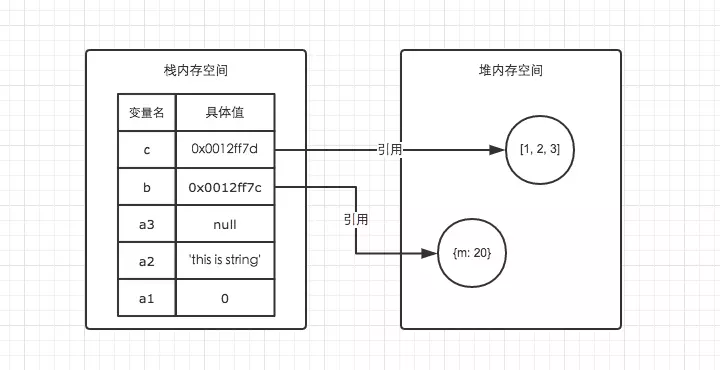

# 堆与栈

js中的堆与栈

## 基础数据类型与栈内存

## 引用数据类型与堆内存

| 栈内存 | 堆内存 |
| ------ | ------|
| 存储基础数据类型| 存储引用类型数据 |
| 按值访问 | 按引用访问 |
|存储的值大小固定| 存储的值大小不定， 可动态调整|
| 由系统自动分配内存| 有程序员通过代码进行分配|
| 主要用来存储执行程序 | 主要用来存放对象 |
| 空间小， 运行效率高 | 空间大， 运行效率低 |
| 先进后出 | 无序存储， 可根据引用直接获取|