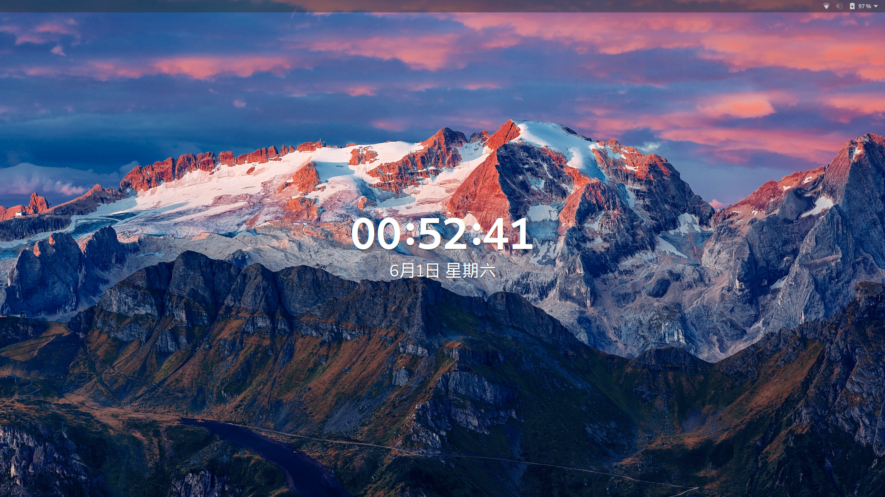
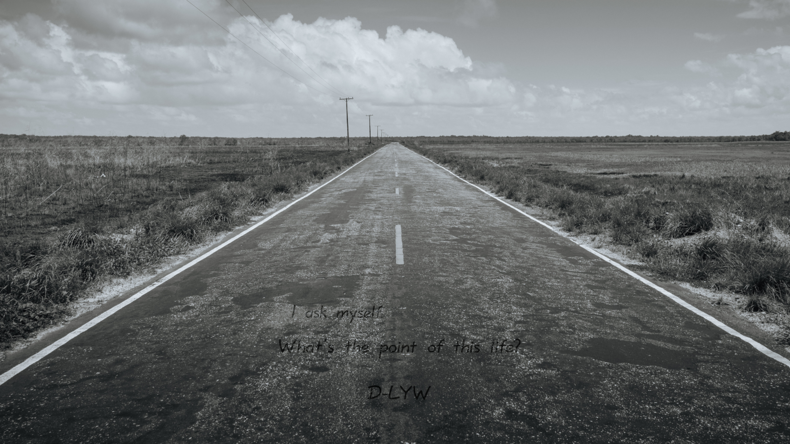
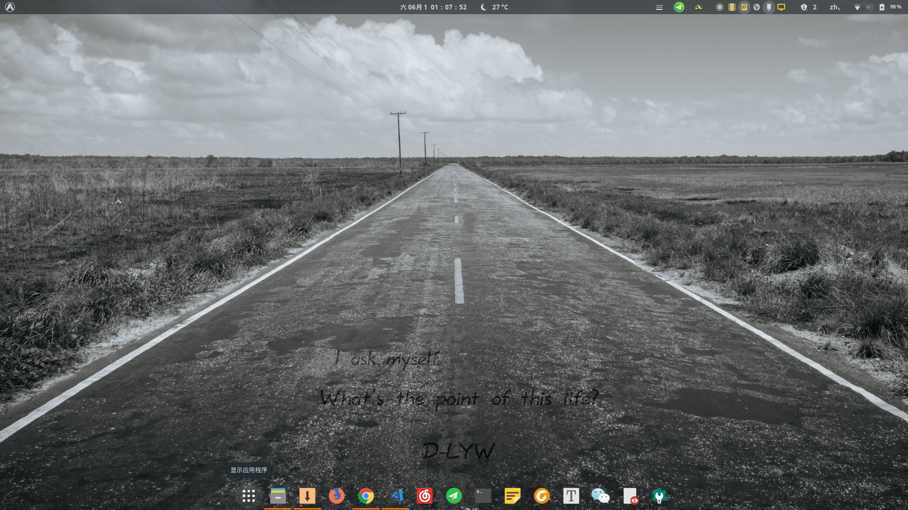

# Linxu Manjaro Gnome 桌面系统美化

> 前言: 本人从大二上开始接触并使用linux系统, 从最开始的Centos/Unbunt, 到国产的deepin发行版, 再到现在使用的Manjaro系统, 每次重新装系统, 就喜欢折腾, 调整美化自己的桌面界面, 毕竟天天使用, 非要弄到自己看到舒服, 花了不少时间, 故想做此文记录一笔, 与喜欢折腾的同学分享.

自己喜欢linux系统, 一方面的原因就是用户对系统的掌控力相对于window系统而言强太多, 我可以在相当大的范围内,按自己的喜好进行调整. 

锁屏界面

Manjaro 桌面
个人比较喜欢简约的风格, 故在默认情况下, `Top bar` 和 下侧的工具栏皆处于隐藏状态. 通过鼠标或快捷键可触发上下侧的热区, 显示内容.

### gnome 扩展

安装扩展的简单方法, 