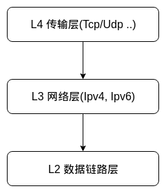

## linux 网络栈



linux网络栈主要设计以上三层. 从本质上来说, linux内核栈的工作就是接收数据包从L2(数据链路层)传递到L3(网络层). 接下来, 如果数据包的目的地址为当前设备, linux内核网络栈将其传给L4(传输层); 如果目的地址不是当前设备, 则将其交还给L2(数据链路层)进行传输(如网络节点中的路由器, 就是对package做后者的操作)

对于本地生成的出站数据包, 将从L4依次传递给L3和L2, 再有网络设备驱动程序进行传输.这个过程分很多阶段, 可能发送以下的行为:

+ 根据协议规则(如IPsec规则或NAT规则), 可能需要对数据包进行修改
+ 数据包可能被丢弃
+ 数据包可能导致设备发送错误消息
+ 可能会对数据包进行分段
+ 可能需要重组数据包
+ 需要计算数据包的校验和

###　数据链路层

网络设备驱动程序

网络设备

网络设备结构体　`net_device`

```c
/**
 *	struct net_device - The DEVICE structure.
 *
 *	Actually, this whole structure is a big mistake.  It mixes I/O
 *	data with strictly "high-level" data, and it has to know about
 *	almost every data structure used in the INET module.
 *
 *	@name:	This is the first field of the "visible" part of this structure
 *		(i.e. as seen by users in the "Space.c" file).  It is the name
 *		of the interface.
 *
 *	@name_hlist: 	Device name hash chain, please keep it close to name[]
 *	@ifalias:	SNMP alias
 *	@mem_end:	Shared memory end
 *	@mem_start:	Shared memory start
 *	@base_addr:	Device I/O address
 *	@irq:		Device IRQ number
 *
 *	@state:		Generic network queuing layer state, see netdev_state_t
 *	@dev_list:	The global list of network devices
 *	@napi_list:	List entry used for polling NAPI devices
 *	@unreg_list:	List entry  when we are unregistering the
 *			device; see the function unregister_netdev
 *	@close_list:	List entry used when we are closing the device
 *	@ptype_all:     Device-specific packet handlers for all protocols
 *	@ptype_specific: Device-specific, protocol-specific packet handlers
 *
 *	@adj_list:	Directly linked devices, like slaves for bonding
 *	@features:	Currently active device features
 *	@hw_features:	User-changeable features
 *
 *	@wanted_features:	User-requested features
 *	@vlan_features:		Mask of features inheritable by VLAN devices
 *
 *	@hw_enc_features:	Mask of features inherited by encapsulating devices
 *				This field indicates what encapsulation
 *				offloads the hardware is capable of doing,
 *				and drivers will need to set them appropriately.
 *
 *	@mpls_features:	Mask of features inheritable by MPLS
 *
 *	@ifindex:	interface index
 *	@group:		The group the device belongs to
 *
 *	@stats:		Statistics struct, which was left as a legacy, use
 *			rtnl_link_stats64 instead
 *
 *	@rx_dropped:	Dropped packets by core network,
 *			do not use this in drivers
 *	@tx_dropped:	Dropped packets by core network,
 *			do not use this in drivers
 *	@rx_nohandler:	nohandler dropped packets by core network on
 *			inactive devices, do not use this in drivers
 *	@carrier_up_count:	Number of times the carrier has been up
 *	@carrier_down_count:	Number of times the carrier has been down
 *
 *	@wireless_handlers:	List of functions to handle Wireless Extensions,
 *				instead of ioctl,
 *				see <net/iw_handler.h> for details.
 *	@wireless_data:	Instance data managed by the core of wireless extensions
 *
 *	@netdev_ops:	Includes several pointers to callbacks,
 *			if one wants to override the ndo_*() functions
 *	@ethtool_ops:	Management operations
 *	@ndisc_ops:	Includes callbacks for different IPv6 neighbour
 *			discovery handling. Necessary for e.g. 6LoWPAN.
 *	@header_ops:	Includes callbacks for creating,parsing,caching,etc
 *			of Layer 2 headers.
 *
 *	@flags:		Interface flags (a la BSD)
 *	@priv_flags:	Like 'flags' but invisible to userspace,
 *			see if.h for the definitions
 *	@gflags:	Global flags ( kept as legacy )
 *	@padded:	How much padding added by alloc_netdev()
 *	@operstate:	RFC2863 operstate
 *	@link_mode:	Mapping policy to operstate
 *	@if_port:	Selectable AUI, TP, ...
 *	@dma:		DMA channel
 *	@mtu:		Interface MTU value
 *	@min_mtu:	Interface Minimum MTU value
 *	@max_mtu:	Interface Maximum MTU value
 *	@type:		Interface hardware type
 *	@hard_header_len: Maximum hardware header length.
 *	@min_header_len:  Minimum hardware header length
 *
 *	@needed_headroom: Extra headroom the hardware may need, but not in all
 *			  cases can this be guaranteed
 *	@needed_tailroom: Extra tailroom the hardware may need, but not in all
 *			  cases can this be guaranteed. Some cases also use
 *			  LL_MAX_HEADER instead to allocate the skb
 *
 *	interface address info:
 *
 * 	@perm_addr:		Permanent hw address
 * 	@addr_assign_type:	Hw address assignment type
 * 	@addr_len:		Hardware address length
 *	@neigh_priv_len:	Used in neigh_alloc()
 * 	@dev_id:		Used to differentiate devices that share
 * 				the same link layer address
 * 	@dev_port:		Used to differentiate devices that share
 * 				the same function
 *	@addr_list_lock:	XXX: need comments on this one
 *	@uc_promisc:		Counter that indicates promiscuous mode // 混杂模式
 *				has been enabled due to the need to listen to
 *				additional unicast addresses in a device that
 *				does not implement ndo_set_rx_mode()
 *	@uc:			unicast mac addresses   // 单播mac地址
 *	@mc:			multicast mac addresses // 多播mac地址
 *	@dev_addrs:		list of device hw addresses
 *	@queues_kset:		Group of all Kobjects in the Tx and RX queues
 *	@promiscuity:		Number of times the NIC is told to work in  // promiscurity计数器
 *				promiscuous mode; if it becomes 0 the NIC will
 *				exit promiscuous mode
 *	@allmulti:		Counter, enables or disables allmulticast mode
 *
 *	@vlan_info:	VLAN info
 *	@dsa_ptr:	dsa specific data
 *	@tipc_ptr:	TIPC specific data
 *	@atalk_ptr:	AppleTalk link
 *	@ip_ptr:	IPv4 specific data
 *	@dn_ptr:	DECnet specific data
 *	@ip6_ptr:	IPv6 specific data
 *	@ax25_ptr:	AX.25 specific data
 *	@ieee80211_ptr:	IEEE 802.11 specific data, assign before registering
 *
 *	@dev_addr:	Hw address (before bcast,
 *			because most packets are unicast)
 *
 *	@_rx:			Array of RX queues
 *	@num_rx_queues:		Number of RX queues
 *				allocated at register_netdev() time
 *	@real_num_rx_queues: 	Number of RX queues currently active in device
 *
 *	@rx_handler:		handler for received packets
 *	@rx_handler_data: 	XXX: need comments on this one
 *	@miniq_ingress:		ingress/clsact qdisc specific data for
 *				ingress processing
 *	@ingress_queue:		XXX: need comments on this one
 *	@broadcast:		hw bcast address
 *
 *	@rx_cpu_rmap:	CPU reverse-mapping for RX completion interrupts,
 *			indexed by RX queue number. Assigned by driver.
 *			This must only be set if the ndo_rx_flow_steer
 *			operation is defined
 *	@index_hlist:		Device index hash chain
 *
 *	@_tx:			Array of TX queues
 *	@num_tx_queues:		Number of TX queues allocated at alloc_netdev_mq() time
 *	@real_num_tx_queues: 	Number of TX queues currently active in device
 *	@qdisc:			Root qdisc from userspace point of view
 *	@tx_queue_len:		Max frames per queue allowed
 *	@tx_global_lock: 	XXX: need comments on this one
 *
 *	@xps_maps:	XXX: need comments on this one
 *	@miniq_egress:		clsact qdisc specific data for
 *				egress processing
 *	@watchdog_timeo:	Represents the timeout that is used by
 *				the watchdog (see dev_watchdog())
 *	@watchdog_timer:	List of timers
 *
 *	@pcpu_refcnt:		Number of references to this device
 *	@todo_list:		Delayed register/unregister
 *	@link_watch_list:	XXX: need comments on this one
 *
 *	@reg_state:		Register/unregister state machine
 *	@dismantle:		Device is going to be freed
 *	@rtnl_link_state:	This enum represents the phases of creating
 *				a new link
 *
 *	@needs_free_netdev:	Should unregister perform free_netdev?
 *	@priv_destructor:	Called from unregister
 *	@npinfo:		XXX: need comments on this one
 * 	@nd_net:		Network namespace this network device is inside
 *
 * 	@ml_priv:	Mid-layer private
 * 	@lstats:	Loopback statistics
 * 	@tstats:	Tunnel statistics
 * 	@dstats:	Dummy statistics
 * 	@vstats:	Virtual ethernet statistics
 *
 *	@garp_port:	GARP
 *	@mrp_port:	MRP
 *
 *	@dev:		Class/net/name entry
 *	@sysfs_groups:	Space for optional device, statistics and wireless
 *			sysfs groups
 *
 *	@sysfs_rx_queue_group:	Space for optional per-rx queue attributes
 *	@rtnl_link_ops:	Rtnl_link_ops
 *
 *	@gso_max_size:	Maximum size of generic segmentation offload
 *	@gso_max_segs:	Maximum number of segments that can be passed to the
 *			NIC for GSO
 *
 *	@dcbnl_ops:	Data Center Bridging netlink ops
 *	@num_tc:	Number of traffic classes in the net device
 *	@tc_to_txq:	XXX: need comments on this one
 *	@prio_tc_map:	XXX: need comments on this one
 *
 *	@fcoe_ddp_xid:	Max exchange id for FCoE LRO by ddp
 *
 *	@priomap:	XXX: need comments on this one
 *	@phydev:	Physical device may attach itself
 *			for hardware timestamping
 *	@sfp_bus:	attached &struct sfp_bus structure.
 *
 *	@qdisc_tx_busylock: lockdep class annotating Qdisc->busylock spinlock
 *	@qdisc_running_key: lockdep class annotating Qdisc->running seqcount
 *
 *	@proto_down:	protocol port state information can be sent to the
 *			switch driver and used to set the phys state of the
 *			switch port.
 *
 *	@wol_enabled:	Wake-on-LAN is enabled
 *
 *	FIXME: cleanup struct net_device such that network protocol info
 *	moves out.
 */

struct net_device {
	char			name[IFNAMSIZ];
	struct hlist_node	name_hlist;
	struct dev_ifalias	__rcu *ifalias;
	/*
	 *	I/O specific fields
	 *	FIXME: Merge these and struct ifmap into one
	 */
	unsigned long		mem_end;
	unsigned long		mem_start;
	unsigned long		base_addr;
	int			irq;

	/*
	 *	Some hardware also needs these fields (state,dev_list,
	 *	napi_list,unreg_list,close_list) but they are not
	 *	part of the usual set specified in Space.c.
	 */

	unsigned long		state;

	struct list_head	dev_list;
	struct list_head	napi_list;
	struct list_head	unreg_list;
	struct list_head	close_list;
	struct list_head	ptype_all;
	struct list_head	ptype_specific;

	struct {
		struct list_head upper;
		struct list_head lower;
	} adj_list;

	netdev_features_t	features;
	netdev_features_t	hw_features;
	netdev_features_t	wanted_features;
	netdev_features_t	vlan_features;
	netdev_features_t	hw_enc_features;
	netdev_features_t	mpls_features;
	netdev_features_t	gso_partial_features;

	int			ifindex;
	int			group;

	struct net_device_stats	stats;

	atomic_long_t		rx_dropped;
	atomic_long_t		tx_dropped;
	atomic_long_t		rx_nohandler;

	/* Stats to monitor link on/off, flapping */
	atomic_t		carrier_up_count;
	atomic_t		carrier_down_count;

#ifdef CONFIG_WIRELESS_EXT
	const struct iw_handler_def *wireless_handlers;
	struct iw_public_data	*wireless_data;
#endif
	const struct net_device_ops *netdev_ops;
	const struct ethtool_ops *ethtool_ops;
#ifdef CONFIG_NET_L3_MASTER_DEV
	const struct l3mdev_ops	*l3mdev_ops;
#endif
#if IS_ENABLED(CONFIG_IPV6)
	const struct ndisc_ops *ndisc_ops;
#endif

#ifdef CONFIG_XFRM_OFFLOAD
	const struct xfrmdev_ops *xfrmdev_ops;
#endif

#if IS_ENABLED(CONFIG_TLS_DEVICE)
	const struct tlsdev_ops *tlsdev_ops;
#endif

	const struct header_ops *header_ops;

	unsigned int		flags;
	unsigned int		priv_flags;

	unsigned short		gflags;
	unsigned short		padded;

	unsigned char		operstate;
	unsigned char		link_mode;

	unsigned char		if_port;
	unsigned char		dma;

	unsigned int		mtu;
	unsigned int		min_mtu;
	unsigned int		max_mtu;
	unsigned short		type;
	unsigned short		hard_header_len;
	unsigned char		min_header_len;

	unsigned short		needed_headroom;
	unsigned short		needed_tailroom;

	/* Interface address info. */
	unsigned char		perm_addr[MAX_ADDR_LEN];
	unsigned char		addr_assign_type;
	unsigned char		addr_len;
	unsigned short		neigh_priv_len;
	unsigned short          dev_id;
	unsigned short          dev_port;
	spinlock_t		addr_list_lock;
	unsigned char		name_assign_type;
	bool			uc_promisc;
	struct netdev_hw_addr_list	uc;
	struct netdev_hw_addr_list	mc;
	struct netdev_hw_addr_list	dev_addrs;

#ifdef CONFIG_SYSFS
	struct kset		*queues_kset;
#endif
	unsigned int		promiscuity;
	unsigned int		allmulti;


	/* Protocol-specific pointers */

#if IS_ENABLED(CONFIG_VLAN_8021Q)
	struct vlan_info __rcu	*vlan_info;
#endif
#if IS_ENABLED(CONFIG_NET_DSA)
	struct dsa_port		*dsa_ptr;
#endif
#if IS_ENABLED(CONFIG_TIPC)
	struct tipc_bearer __rcu *tipc_ptr;
#endif
#if IS_ENABLED(CONFIG_IRDA) || IS_ENABLED(CONFIG_ATALK)
	void 			*atalk_ptr;
#endif
	struct in_device __rcu	*ip_ptr;
#if IS_ENABLED(CONFIG_DECNET)
	struct dn_dev __rcu     *dn_ptr;
#endif
	struct inet6_dev __rcu	*ip6_ptr;
#if IS_ENABLED(CONFIG_AX25)
	void			*ax25_ptr;
#endif
	struct wireless_dev	*ieee80211_ptr;
	struct wpan_dev		*ieee802154_ptr;
#if IS_ENABLED(CONFIG_MPLS_ROUTING)
	struct mpls_dev __rcu	*mpls_ptr;
#endif

/*
 * Cache lines mostly used on receive path (including eth_type_trans())
 */
	/* Interface address info used in eth_type_trans() */
	unsigned char		*dev_addr;

	struct netdev_rx_queue	*_rx;
	unsigned int		num_rx_queues;
	unsigned int		real_num_rx_queues;

	struct bpf_prog __rcu	*xdp_prog;
	unsigned long		gro_flush_timeout;
	rx_handler_func_t __rcu	*rx_handler;
	void __rcu		*rx_handler_data;

#ifdef CONFIG_NET_CLS_ACT
	struct mini_Qdisc __rcu	*miniq_ingress;
#endif
	struct netdev_queue __rcu *ingress_queue;
#ifdef CONFIG_NETFILTER_INGRESS
	struct nf_hook_entries __rcu *nf_hooks_ingress;
#endif

	unsigned char		broadcast[MAX_ADDR_LEN];
#ifdef CONFIG_RFS_ACCEL
	struct cpu_rmap		*rx_cpu_rmap;
#endif
	struct hlist_node	index_hlist;

/*
 * Cache lines mostly used on transmit path
 */
	struct netdev_queue	*_tx ____cacheline_aligned_in_smp;
	unsigned int		num_tx_queues;
	unsigned int		real_num_tx_queues;
	struct Qdisc		*qdisc;
#ifdef CONFIG_NET_SCHED
	DECLARE_HASHTABLE	(qdisc_hash, 4);
#endif
	unsigned int		tx_queue_len;
	spinlock_t		tx_global_lock;
	int			watchdog_timeo;

#ifdef CONFIG_XPS
	struct xps_dev_maps __rcu *xps_cpus_map;
	struct xps_dev_maps __rcu *xps_rxqs_map;
#endif
#ifdef CONFIG_NET_CLS_ACT
	struct mini_Qdisc __rcu	*miniq_egress;
#endif

	/* These may be needed for future network-power-down code. */
	struct timer_list	watchdog_timer;

	int __percpu		*pcpu_refcnt;
	struct list_head	todo_list;

	struct list_head	link_watch_list;

	enum { NETREG_UNINITIALIZED=0,
	       NETREG_REGISTERED,	/* completed register_netdevice */
	       NETREG_UNREGISTERING,	/* called unregister_netdevice */
	       NETREG_UNREGISTERED,	/* completed unregister todo */
	       NETREG_RELEASED,		/* called free_netdev */
	       NETREG_DUMMY,		/* dummy device for NAPI poll */
	} reg_state:8;

	bool dismantle;

	enum {
		RTNL_LINK_INITIALIZED,
		RTNL_LINK_INITIALIZING,
	} rtnl_link_state:16;

	bool needs_free_netdev;
	void (*priv_destructor)(struct net_device *dev);

#ifdef CONFIG_NETPOLL
	struct netpoll_info __rcu	*npinfo;
#endif

	possible_net_t			nd_net;

	/* mid-layer private */
	union {
		void					*ml_priv;
		struct pcpu_lstats __percpu		*lstats;
		struct pcpu_sw_netstats __percpu	*tstats;
		struct pcpu_dstats __percpu		*dstats;
	};

#if IS_ENABLED(CONFIG_GARP)
	struct garp_port __rcu	*garp_port;
#endif
#if IS_ENABLED(CONFIG_MRP)
	struct mrp_port __rcu	*mrp_port;
#endif

	struct device		dev;
	const struct attribute_group *sysfs_groups[4];
	const struct attribute_group *sysfs_rx_queue_group;

	const struct rtnl_link_ops *rtnl_link_ops;

	/* for setting kernel sock attribute on TCP connection setup */
#define GSO_MAX_SIZE		65536
	unsigned int		gso_max_size;
#define GSO_MAX_SEGS		65535
	u16			gso_max_segs;

#ifdef CONFIG_DCB
	const struct dcbnl_rtnl_ops *dcbnl_ops;
#endif
	s16			num_tc;
	struct netdev_tc_txq	tc_to_txq[TC_MAX_QUEUE];
	u8			prio_tc_map[TC_BITMASK + 1];

#if IS_ENABLED(CONFIG_FCOE)
	unsigned int		fcoe_ddp_xid;
#endif
#if IS_ENABLED(CONFIG_CGROUP_NET_PRIO)
	struct netprio_map __rcu *priomap;
#endif
	struct phy_device	*phydev;
	struct sfp_bus		*sfp_bus;
	struct lock_class_key	*qdisc_tx_busylock;
	struct lock_class_key	*qdisc_running_key;
	bool			proto_down;
	unsigned		wol_enabled:1;
};
```


### Netlink套接字

Netlink套接字, 它提供了一种在用户空间和内核间进行通信的机制, 被广泛用户网络子系统.

```c
// 在用户空间创建Netlink套接字
socket(AF_NETLINK, SOCK_RAW, NETLINK_ROUTE);


// sockaddr_nl对象(Netlink套接字地址结构)
struct sockaddr_nl {
    __kernel_sa_family_t    nl_family;  // AF_NETLINK
    unsigned short          nl_pad;     // 为零 
    __u32                   nl_pid;     // 端口号
    __u32                   nl_groups;  // 组播组掩码
}
```

### IPv4

IPv4协议(Internet协议第4版)是当今基于标准的Internet中的核心协议之一, 大部分流量都是由它传输的. 1981年发布的RFC791(Internet Protocol)对IPv4协议做了基本的定义, 它可在任何两台主机间提供端到端的连接. IP层的另一个重要功能是转发数据包(也叫路由选择)以及管理路由选择信息表.


#### 其他

+ inet    -- TCP/IPv4协议
+ inet6   -- TCP/IPv6协议
+ ax25    -- 无线分组协议
+ ddp     -- Apple协议
+ ipx	  -- Novell协议