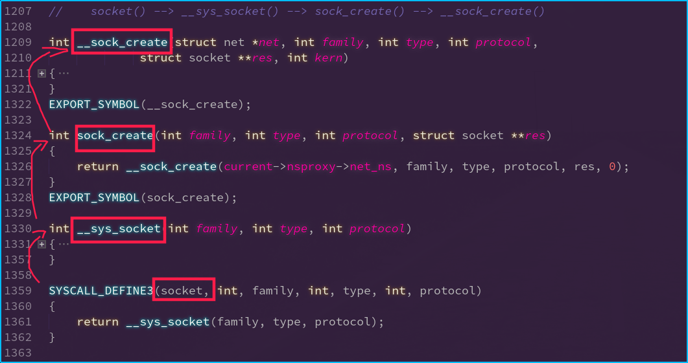
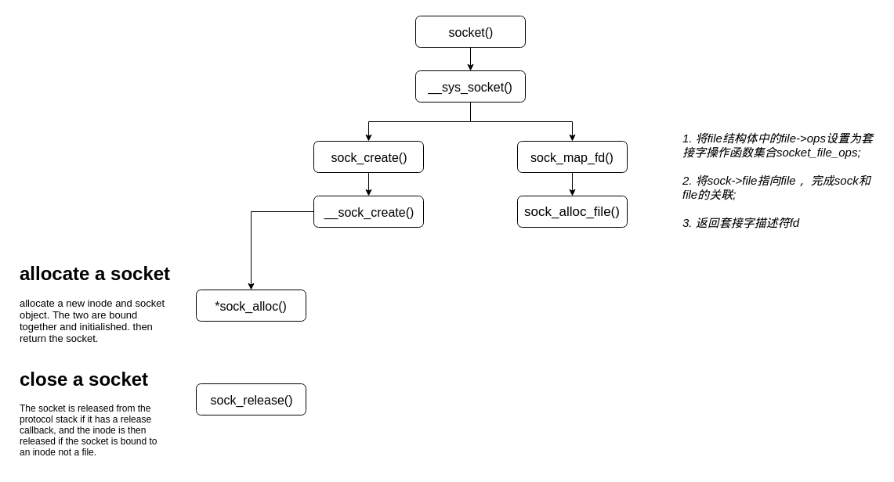

# linux - 网络子系统源码追踪学习


linux 中所有支持的协议簇类型, 其中大多用的比较多的,肯定是 ``AF_INET`` 基于ipv4的网络套接字

```c
/include/linux/socket.h
/* Supported address families. */
#define AF_UNSPEC	0
#define AF_UNIX		1	/* Unix domain sockets 		*/	// Unix域协议
#define AF_LOCAL	1	/* POSIX name for AF_UNIX	*/
#define AF_INET		2	/* Internet IP Protocol 	*/	// ipv4协议
#define AF_AX25		3	/* Amateur Radio AX.25 		*/
#define AF_IPX		4	/* Novell IPX 			*/
#define AF_APPLETALK	5	/* AppleTalk DDP 		*/
#define AF_NETROM	6	/* Amateur Radio NET/ROM 	*/
#define AF_BRIDGE	7	/* Multiprotocol bridge 	*/
#define AF_ATMPVC	8	/* ATM PVCs			*/
#define AF_X25		9	/* Reserved for X.25 project 	*/
#define AF_INET6	10	/* IP version 6			*/	// ipv6协议
#define AF_ROSE		11	/* Amateur Radio X.25 PLP	*/
#define AF_DECnet	12	/* Reserved for DECnet project	*/
#define AF_NETBEUI	13	/* Reserved for 802.2LLC project*/
#define AF_SECURITY	14	/* Security callback pseudo AF */
#define AF_KEY		15      /* PF_KEY key management API */		// 秘钥套接字
#define AF_NETLINK	16
#define AF_ROUTE	AF_NETLINK /* Alias to emulate 4.4BSD */	// 路由套接字
#define AF_PACKET	17	/* Packet family		*/	//
#define AF_ASH		18	/* Ash				*/
#define AF_ECONET	19	/* Acorn Econet			*/
#define AF_ATMSVC	20	/* ATM SVCs			*/
#define AF_RDS		21	/* RDS sockets 			*/
#define AF_SNA		22	/* Linux SNA Project (nutters!) */
#define AF_IRDA		23	/* IRDA sockets			*/
#define AF_PPPOX	24	/* PPPoX sockets		*/
#define AF_WANPIPE	25	/* Wanpipe API Sockets */
#define AF_LLC		26	/* Linux LLC			*/
#define AF_IB		27	/* Native InfiniBand address	*/
#define AF_MPLS		28	/* MPLS */
#define AF_CAN		29	/* Controller Area Network      */
#define AF_TIPC		30	/* TIPC sockets			*/
#define AF_BLUETOOTH	31	/* Bluetooth sockets 		*/
#define AF_IUCV		32	/* IUCV sockets			*/
#define AF_RXRPC	33	/* RxRPC sockets 		*/
#define AF_ISDN		34	/* mISDN sockets 		*/
#define AF_PHONET	35	/* Phonet sockets		*/
#define AF_IEEE802154	36	/* IEEE802154 sockets		*/
#define AF_CAIF		37	/* CAIF sockets			*/
#define AF_ALG		38	/* Algorithm sockets		*/
#define AF_NFC		39	/* NFC sockets			*/
#define AF_VSOCK	40	/* vSockets			*/
#define AF_KCM		41	/* Kernel Connection Multiplexor*/
#define AF_QIPCRTR	42	/* Qualcomm IPC Router          */
#define AF_SMC		43	/* smc sockets: reserve number for
				 * PF_SMC protocol family that
				 * reuses AF_INET address family
				 */
#define AF_XDP		44	/* XDP sockets			*/

#define AF_MAX		45	/* For now.. */
```

在linux中, socket套接字有哪些类型, 它的结构体有哪些参数呢?

```c
/include/linux/net.h 
/**
 * enum sock_type - Socket types
 * @SOCK_STREAM: stream (connection) socket
 * @SOCK_DGRAM: datagram (conn.less) socket
 * @SOCK_RAW: raw socket
 * @SOCK_RDM: reliably-delivered message		// 可靠传输的数据
 * @SOCK_SEQPACKET: sequential packet socket	// 顺序数据包套接字
 * @SOCK_DCCP: Datagram Congestion Control Protocol socket		// 数据包拥塞控制协议套接字
 * @SOCK_PACKET: linux specific way of getting packets at the dev level.	// 在开发级别获取数据包
 *		  For writing rarp and other similar things on the user level.
 */
enum sock_type {
	SOCK_STREAM	= 1,
	SOCK_DGRAM	= 2,
	SOCK_RAW	= 3,
	SOCK_RDM	= 4,
	SOCK_SEQPACKET	= 5,
	SOCK_DCCP	= 6,
	SOCK_PACKET	= 10,
};
```

前三种套接字类型 `SOCK_STREAM`, `SOCK_DGRAM` 和 `SOCK_RAW`, 大家如果有一定的socket网络编程的了解, 肯定知道他们对应着流套接字, 和数据包套接字. 第三个原始套接字类型, 自己可以构造套接字的结构, 如实现一个基于icmp的ping程序.


接下来, 就需要介绍我们的第一个重要的结构体了. 谈网络子系统, 肯定需要网络套接字, 而各种类型的函数操作调用肯定又离不开 `struct socket`
```c
/include/linux/net.h
/**
 *  struct socket - general BSD socket
 *  @state: socket state (%SS_CONNECTED, etc)
 *  @type: socket type (%SOCK_STREAM, etc)
 *  @flags: socket flags (%SOCK_NOSPACE, etc)
 *  @ops: protocol specific socket operations
 *  @file: File back pointer for gc
 *  @sk: internal networking protocol agnostic socket representation
 *  @wq: wait queue for several uses
 */
struct socket {
	socket_state		state;		// 标记套接字的状态
	short			type;		// 标记套接字的类型
	unsigned long		flags;		// 套接字相关的标志量
	struct socket_wq	*wq;
	struct file		*file;
	struct sock		*sk;
	const struct proto_ops	*ops;
};
```

sock 类型的指针 ***sk***: 它是该套接字在网络层的表示. 后续的如connect, accept等函数的网络层实现, 都与该结构体密切相关.

###### 注: 由于该结构体长度过长, 仅展示部分注释, 推荐[下载linux源码一窥全貌](https://www.kernel.org), 口感更佳(所有贴出代码, 皆注明源码文件位置)

```c
/include/net/sock.h
/**
 *	struct sock_common - minimal network layer representation of sockets
 *	@skc_daddr: Foreign IPv4 addr		// 远端的目的地址
 *	@skc_rcv_saddr: Bound local IPv4 addr	// 绑定的本地地址
 *	@skc_hash: hash value used with various protocol lookup tables	// 用于查询各种协议查询表的hash值
 *	@skc_u16hashes: two u16 hash values used by UDP lookup tables
 *	@skc_dport: placeholder for inet_dport/tw_dport
 *	@skc_num: placeholder for inet_num/tw_num
 *	@skc_family: network address family		// 套接字协议族类型
 *	@skc_state: Connection state
 *	@skc_reuse: %SO_REUSEADDR setting		// 地址重用设置
 *	@skc_reuseport: %SO_REUSEPORT setting
 *	@skc_bound_dev_if: bound device index if != 0
 *	@skc_bind_node: bind hash linkage for various protocol lookup tables
 *	@skc_portaddr_node: second hash linkage for UDP/UDP-Lite protocol
 *	@skc_prot: protocol handlers inside a network family
 *	@skc_net: reference to the network namespace of this socket
 *	@skc_node: main hash linkage for various protocol lookup tables
 *	@skc_nulls_node: main hash linkage for TCP/UDP/UDP-Lite protocol
 *	@skc_tx_queue_mapping: tx queue number for this connection
 *	@skc_rx_queue_mapping: rx queue number for this connection
 *	@skc_flags: place holder for sk_flags
 *		%SO_LINGER (l_onoff), %SO_BROADCAST, %SO_KEEPALIVE,
 *		%SO_OOBINLINE settings, %SO_TIMESTAMPING settings
 *	@skc_incoming_cpu: record/match cpu processing incoming packets  // 记录/匹配cpu处理传入的数据包
 *	@skc_refcnt: reference count
 *
 *	This is the minimal network layer representation of sockets, the header
 *	for struct sock and struct inet_timewait_sock.
 */
```

proto_ops 类型的指针 ***ops***: 它是特定套接字类型的函数操作集合, 不同类型的套接字拥有不同的操作函数.

```c
/include/linux/net.h
struct proto_ops {
	int		family;
	struct module	*owner;
	int		(*release)   (struct socket *sock);
	int		(*bind)	     (struct socket *sock,
				      struct sockaddr *myaddr,
				      int sockaddr_len);
	int		(*connect)   (struct socket *sock,
				      struct sockaddr *vaddr,
				      int sockaddr_len, int flags);
	int		(*socketpair)(struct socket *sock1,
				      struct socket *sock2);
	int		(*accept)    (struct socket *sock,
				      struct socket *newsock, int flags, bool kern);
	int		(*getname)   (struct socket *sock,
				      struct sockaddr *addr,
				      int peer);
	__poll_t	(*poll)	     (struct file *file, struct socket *sock,
				      struct poll_table_struct *wait);
	int		(*ioctl)     (struct socket *sock, unsigned int cmd,
				      unsigned long arg);
	int		(*listen)    (struct socket *sock, int len);
	int		(*shutdown)  (struct socket *sock, int flags);
	int		(*setsockopt)(struct socket *sock, int level,
				      int optname, char __user *optval, unsigned int optlen);
	int		(*getsockopt)(struct socket *sock, int level,
				      int optname, char __user *optval, int __user *optlen);
	int		(*sendmsg)   (struct socket *sock, struct msghdr *m,
				      size_t total_len);
	int		(*recvmsg)   (struct socket *sock, struct msghdr *m,
				      size_t total_len, int flags);
	int		(*mmap)	     (struct file *file, struct socket *sock,
				      struct vm_area_struct * vma);
	ssize_t		(*sendpage)  (struct socket *sock, struct page *page,
				      int offset, size_t size, int flags);
	ssize_t 	(*splice_read)(struct socket *sock,  loff_t *ppos,
				       struct pipe_inode_info *pipe, size_t len, unsigned int flags);
	int		(*set_peek_off)(struct sock *sk, int val);
	int		(*peek_len)(struct socket *sock);

	/* The following functions are called internally by kernel with
	 * sock lock already held.
	 */
	int		(*read_sock)(struct sock *sk, read_descriptor_t *desc,
				     sk_read_actor_t recv_actor);
	int		(*sendpage_locked)(struct sock *sk, struct page *page,
					   int offset, size_t size, int flags);
	int		(*sendmsg_locked)(struct sock *sk, struct msghdr *msg,
					  size_t size);
	int		(*set_rcvlowat)(struct sock *sk, int val);
};
```


socket 套接字的相关函数的源码入口都在 `/net/socket.c` 文件中

+ socket()
+ socketpair()
+ bind()
+ listen()
+ accept()
+ accept4()      // 多了一个flag标志位，是一个新引入系统的系统调用， 支持SOCK_NONBLOCK和SOCK_CLOEXEC
+ connect()
+ getsockname()
+ getpeername()
+ sendto()
+ send()
+ recvfrom()
+ recv()
+ setsockopt()
+ getsockopt()
+ shutdown()


#### socket() 函数源码分析

想要使用socket套接字进行通信, 首先要使用socket()函数生成一个指定协议类型的套接字

```c
#include <sys/socket.h>
int socket(int family, int type, int protocol); // 失败,返回-1; 成功, 返回非负整数
```



`socket()`: 实际上是调用`__sys_socket`函数; 
`__sys_socket()`: 检查参数合法性, 调用`sock_create`函数, 调用 `sock_map_fd`函数;
`sock_create() --> __sock_create()`: 分配一个新的struct socket 结构体;
`sock_map_fd`: 分配一个新的套接字描述符 sockfd , 调用`sock_alloc_file`函数, 它主要是申请并初始化一个文件管理结构 file, 对file结构设置socket文件特有的 `socket_file_ops` 操作集合, 将socket结构体中的file指向该file.



可以看出创建一个新的socket套接字, 主要消耗
+ 一个 struct socket 结构体
+ 一个 未使用套接字描述符 sockfd
	- 套接字描述符也是文件描述符, 为一个非负的整数. 实际上就是一个文件句柄. 用户空间使用文件描述符和内核进行交互, 而内核拿到文件描述符后, 通过它得到管理文件的真正的数据结构(如后续的`sockfd_lookup_light`函数)
+ 一个 文件管理结构 file
	- 在linux中, 是 "一切皆文件" 的思想. linux内核将一切视为文件, 它可以是物理文件, 管道, 设备, 网络套接字等linux管理的所有对象. 这些对象使用VFS机制, 以文件系统的形式挂载到linux内核中, 对外提供一致的文件操作接口.

linux会根据不同的文件类型, 挂载不同的文件操作函数 `file_operations` 

```c
/net/socket.c
static const struct file_operations socket_file_ops = {
	.owner =	THIS_MODULE,
	.llseek =	no_llseek,
	.read_iter =	sock_read_iter,
	.write_iter =	sock_write_iter,
	.poll =		sock_poll,
	.unlocked_ioctl = sock_ioctl,
#ifdef CONFIG_COMPAT
	.compat_ioctl = compat_sock_ioctl,
#endif
	.mmap =		sock_mmap,
	.release =	sock_close,
	.fasync =	sock_fasync,
	.sendpage =	sock_sendpage,
	.splice_write = generic_splice_sendpage,
	.splice_read =	sock_splice_read,
};
```

在初始化file结构时, 将其自定义的文件操作赋给file->f_op, 从而实现在VFS中可以调用socket文件系统自定义的操作.
