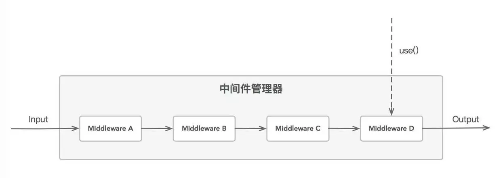

# Node.js 中间件设计模式

`中间件` 在nodejs中被广泛使用, 它i泛指一种特定的设计模式, 一系列的处理单元, 过滤器和处理程序, 以函数的形式存在,连接在一起, 形成一个异步队列, 来完成i度任何数据的预处理和后处理

它的优点在于 `灵活性` : 使用中间件我们用极少的操作就能得到一个插件, 用最简单的方法e就能将新的过滤器和处理函数扩展到现有系统中.

在软件领域, 中间件指应用与应用之间的连接模块比如 Delphi写的桌面app 要跟 java写的Web服务 之间交换数据  需要一个双方都能通信的组件. 但在nodejs中, 中间件一般指 一个函数队列,  你把一堆执行不同操作的函数push到一个队列, 然后每次pop出来执行, 直到队列为空.

要实现中间件模式，最重要的实现细节是：

+ 可以通过调用use()函数来注册新的中间件，通常，新的中间件只能被添加到高压包带的末端，但不是严格要求这么做；

+ 当接收到需要处理的新数据时，注册的中间件在意不执行流程中被依次调用。每个中间件都接受上一个中间件的执行结果作为输入值；

+ 每个中间件都可以停止数据的进一步处理，只需要简单地不调用它的毁掉函数或者将错误传递给回调函数。当发生错误时，通常会触发执行另一个专门处理错误的中间件。

至于怎么处理传递数据，目前没有严格的规则，一般有几种方式

+ 通过添加属性和方法来增强；

+ 使用某种处理的结果来替换 data；

+ 保证原始要处理的数据不变，永远返回新的副本作为处理的结果。

## Express中的中间件

> **Express 是一个路由和中间的web架构**, 其自身只有最低程度的功能: *Express 应用程序基本上是一系列中间件函数的调用*

中间件函数 能够访问 请求对象(req), 响应对象(res), 以及应用程序的请求/响应循环中的下一个中间件函数. 下一个中间件函数通常由 next 变量表示.

#### 中间件函数可以执行以下任务:

+ 执行代码
+ 对请求响应对象进行更改
+ 结束请求/响应循环
+ 调用堆栈中的下一个中间件函数

如果当前中间件函数没有结束请求/响应循环, 那么它必须调用 next(), 以将控制权传递给下一个中间件函数, 否则, 请求将处于挂载状态

#### Express应用程序可以使用下列类型的中间件:

+ 应用层中间件
+ 路由器层中间件
+ 错误处理中间件
+ 内置中间件
+ 第三方中间件

## 从源码上理解 Express 中间件

express 源码目录结构

--lib
    |__ middleware
        |__ init.js
        |__ query.js
    |__ router
        |__ index.js
        |__ layer.js
        |__ route.js
    |__ application.js
    |__ express.js
    |__ request.js
    |__ response.js
    |__ utils.js
    |__ view.js

博客链接

+ [从源码上理解express中间件](https://juejin.im/post/5c10b5176fb9a049af6d1e1e)
+ [express 源码阅读（全）](https://segmentfault.com/a/1190000011090124)

## Koa 中的 中间件

