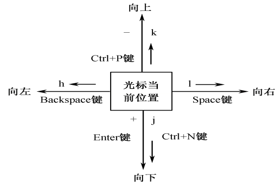

# vim 常用快捷键小记

## 一、vi/vim 的工作模式

+ 命令模式(normal mode)
+ 输入模式(insert mode)
+ 转义模式

## 二、进入和退出

##### 进入vim

vim newFile

##### 退出vim

- `：wq` -- 把编辑缓冲区的内容写到指定的文件中， 退出编辑器， 回到shell状态
- `：ZZ` -- 仅当对所编辑的内容进行过修改时， 才将缓冲区的内容写入文件中
- `：x` -- 与 :ZZ 的功能相同
- `：q!` -- 强制退出vi， 感叹号（！）告诉vi， 无条件退出， 放弃缓冲区的内容。

## 三、文本输入

#### 1. 插入命令

| 命令 |                             效果                             |
| :--: | :----------------------------------------------------------: |
| `i`  | 在i命令输入后， 输入的内容都插在光标位置之前， 光标后的文本相应向右移动 |
| `I`  | 输入I命令之后， 在当前行的行首插入新增文本， 光标移动到行首  |

#### 2. 附加命令

| 命令 |                             效果                             |
| :--: | :----------------------------------------------------------: |
| `a`  |                     在光标后开始插入字符                     |
| `A`  | 在当前行的行尾添加文本， 输入A命令后， 光标自动移动到该行行尾 |

#### 3. 打开命令

| 命令 |                        效果                         |
| :--: | :-------------------------------------------------: |
| `o`  | 在当前行的下面开辟一行， 随后输入的文本就插入该行上 |
| `O`  | 在当前行的上面开辟一行， 随后输入的内容就插入该行上 |

#### 4. 输入模式下光标的移动

## 四、光标移动

|   命令   |                             效果                             |
| :------: | :----------------------------------------------------------: |
|    0     |    将光标移动到当前行的第一个字符， 不管它是否为空白字符     |
|    ^     |   将光标移到当前行的第一个非空白符上（非制表符或非空格符）   |
|    $     | 将光标移到当前行的行尾， 停在最后一个字符上。如果在它前面输入了一个数字n， 则光标移动到下面n-1行的行尾， 如8$. |
| [行号]G  |   将光标移至指定行号的行首， 如3G， 则将光标移至第三行行首   |
| [列号]\| |                   将光标移至当前行指定列上                   |
|   w/W    |                   将光标移至下一个词的开头                   |
|   b/B    |                   将光标退到前一个词的开头                   |
|   e/E    |                        将光标移至词尾                        |
|  ( / )   |        ( 和 ) 分别将光标移至上一个和下一个句子的开头         |
|    L     |                        将光标移至底行                        |

4组基本移动光标命令：

## 五、文本修改

在命令模式下， 使用相关命令对文本进行修改。

| 命令 | 效果                                                         |
| :--: | ------------------------------------------------------------ |
|  x   | 删除光标所在字符，如果前面给出一个数值n， 则由光标所在字符开始， 向右删除n个字符， 如， 5x |
|  X   | 删除光标前面的那个字符。 如果前面给出数值n， 则由光标之前的那个字符开始， 向左删除n个字符 |
|  dd  | 删除光标所在行                                               |
| d... | d与光标移动命令(以...表示)组合而成的命令就从光标位置开始删到由光标移动限定的文本对象的末尾。 |
|  D   | 从光标位置开始删除到行尾                                     |
|  u   | 复原命令， 取消刚才的插入或删除命令                          |
|  .   | 重复命令。仅重复实现最近一次的命令， 而不能执行更早的命令    |
|  J   | 文本合并命令， 把当前行与下面一行合并成一行。 如果在J之前给出一个数字， 如3J， 表示把当前行以及后面两行合并成一行 |

| 命令 | 效果                                                         |
| :--: | ------------------------------------------------------------ |
|  s   | s命令用随后输入的正文替代光标所在的字符。 如果在s前面给出一个数字， 如 5s， 则光标所在字符及其后的4个字符将被新输入的字符替换 |
|  S   | S 命令用新输入的正文替代当前行。如3S， 表示从当前行开始的三行被新输入的正文替换。 |

| 命令 | 效果                                                         |
| :--: | ------------------------------------------------------------ |
|  r   | 取代命令。 用随后输入的单个字符取代光标所在字符。 如果在r前面出现数字， 如3rA， 则从光标位开始向右共有3个字符被新输入的字符替换。 |
|  R   | 用随后输入的文本取代光标位所在字符， 每输入一个字符就替代原有的一个字符。 |

