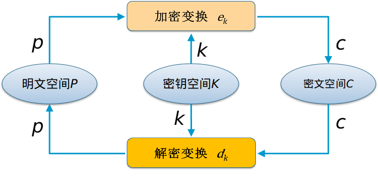

# 一. 什么是密码系统?

##  1.1 *密码系统中的基本概念*

+ 明文(Plain text):作为加密输入的原始信息
+ 密文(Cipher text):明文经加密变换后得到的结果
+ 密钥(Key):参与密码变换的参数
+ 加密算法(Encryption):将明文变为密文的变换函数 
+ 解密算法(Decryption):将密文恢复为明文的变换函数


对于有实用意义的密码算法来说，总是有


## 1.2 *密码系统的基本架构*



## 1.3 *密码系统主要分类*

####  a. 对称密码系统(Symmetric Encryption)


对称密码体制中，加密算法和解密算法使用`相同的密钥`

+ 优点
    - 加解密处理速度快
+ 缺点
    - 系统的安全性依赖于密钥的安全分配方案
    - 多人通信时密钥数量急剧增加
    - 通信双方在通信前必须统一密钥
    - 存在抵赖和身份认证等问题

#### b. 非对称密码系统(Asymmetric Encryption)


非对称密码体制中,加密算法和解密算法使用不同的密钥

+ 优点
    - 公私密钥对易于管理
    - 密钥分配无需安全信道
    - 可以实现签名和认证
+ 缺点
    - 加解密速度很慢


# 二. 密码系统的安全性

>   ##
>    ###     对手知道加密/解密算法!
>                       -荷兰密码学家Kerckhoof《军事密码学》 1883年

在考察密码算法的安全性时,可以将破译算法分为不同级别:

• 全部破译(Total break):找出密钥
• 全部推导(Global deduction):找出替代算法
• 实例推导(Instance deduction):找出明文
• 信息推导(Information deduction):获取有关密钥或明文的信息

## 2.1 密码系统的攻击方法

1. 唯密文攻击(Ciphertext-only Attack)
密码分析者仅仅通过密文找出所使用的密钥和对应的明文;

2. 已知明文攻击(Known-plaintext Attack)
密码分析者获取了一定数量的明文-密文对,试图找到对应的密钥;

3. 选择明文攻击(Chosen-plaintext Attack)
密码分析者能够根据自己的要求选择明文,并加密得到对应的密文,
从而获得明文-密文对,在此基础上试图找到对应的密钥;

4. 选择文本攻击(Chosen-text Attack)
密码分析者已知加密算法,并随意选择明文和密文,进行加解密分
析,在此基础上试图找到密钥;

## 2.2 密码系统安全性评价指标

+ `计算安全性`: 使用最好破译算法攻破一个密码系统所需的操作次数;
+ `可证明安全性`: 将密码算法的安全性归结于一个NP难数学难题,证明两者的求解是等价的。
+ `无条件安全性`: 在不限制计算资源和时间的条件下依然无法破解密码算法

# 三. 几种常见的古典密码体制

+ 移位密码
+ 代换密码
+ 仿射密码
+ 维吉尼亚密码
+ 希尔密码
+ 置换密码

## 3.1 移位密码


## 3.2 代换密码


移位密码是代换密码的一种特殊形式

## 3.3 仿射密码


```
代换密码：明文字母被不同的密文字母所代替。
置换密码：明文和密文的所有字母不变，只是打乱了顺序
```

# 四. 分组密码

#### 分组密码的设计基本原则
`扩散（Diffusion）`与`混乱（Confusion）`原则

+ `扩散`：重新排列消息中的每一个比特，以使明文中任何冗余度能扩散到整个密文，将每一比特明文的影响尽可能作用到较多的输出密文位中，或密文的每一比特都要取决于部分或者全部明文位

+ `混乱`：使密文和密钥之间的统计特征关系尽可能地复杂化，其目的在于隐藏密文和密钥之间的关系，以避免攻击者利用密文来找出密钥


# 五. 序列密码

# 六. 非对称密码体制

# 七. HASH函数

# 八. 数字签名

# 九. 身份识别和认证
